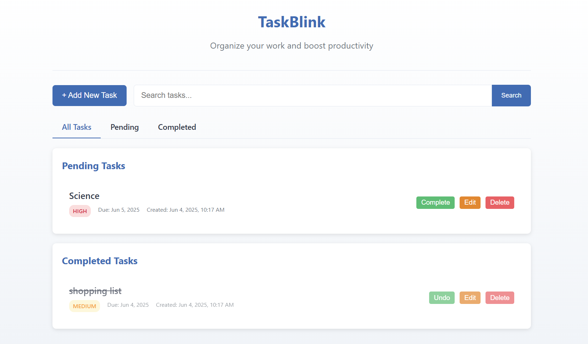

# OIBSIP_Level2_Task3
# ✅ TaskBlink – Smart To-Do List Manager

**TaskBlink** is a sleek and powerful web-based To-Do List Manager that helps you manage daily tasks, prioritize work, and stay organized — all from your browser with **zero installations**. It offers a seamless UI, smart sorting, and built-in local storage support.

## ✨ Main Features

- 📝 **Add, Edit, Delete Tasks**
- ⏰ **Set Due Date & Time**
- 🟢 **Priority Tags (High/Medium/Low)**
- ✅ **Mark Tasks as Complete/Incomplete**
- 🔍 **Search and filter tasks in real-time**
- 🗂️ **Tabs: All / Pending / Completed**
- 💾 **Auto-Save with localStorage**

### 📱 Responsive & Clean UI
Modern, responsive layout built with **HTML, CSS, and Vanilla JS** — optimized for both desktop and mobile use.

---
## 🖼️ Preview

> 
